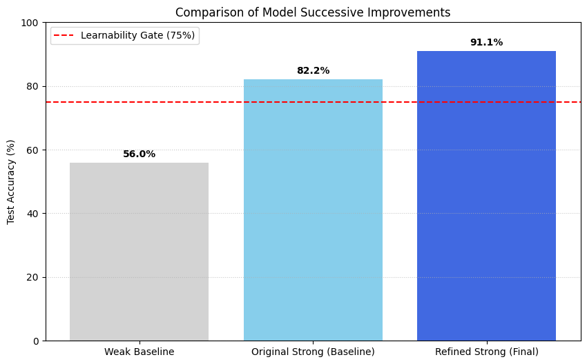
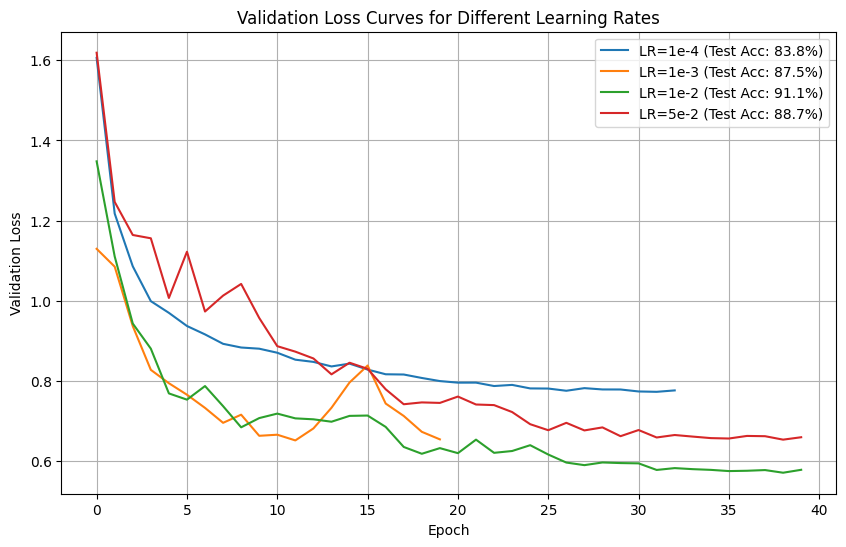
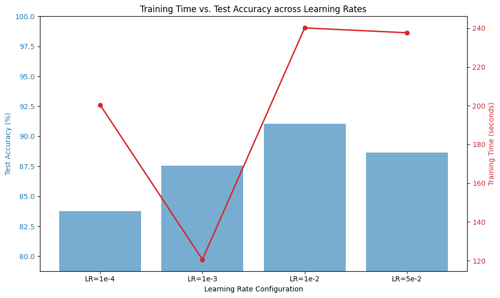
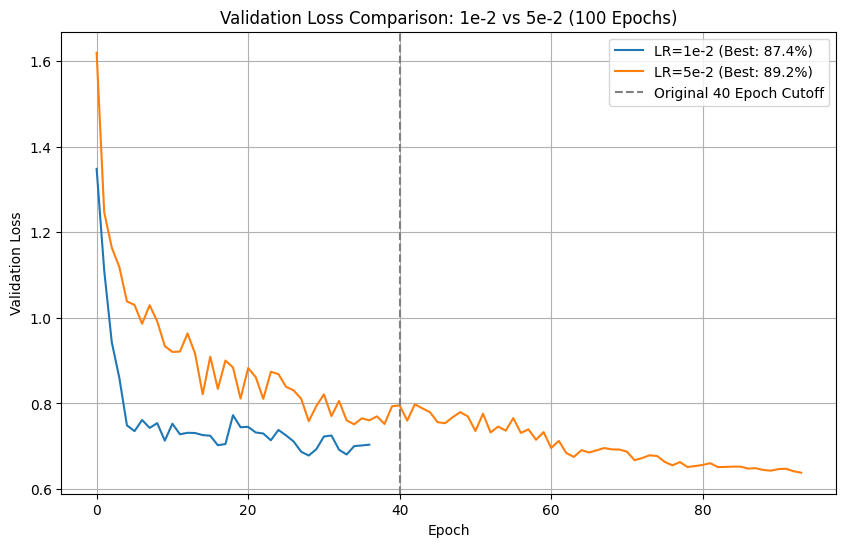
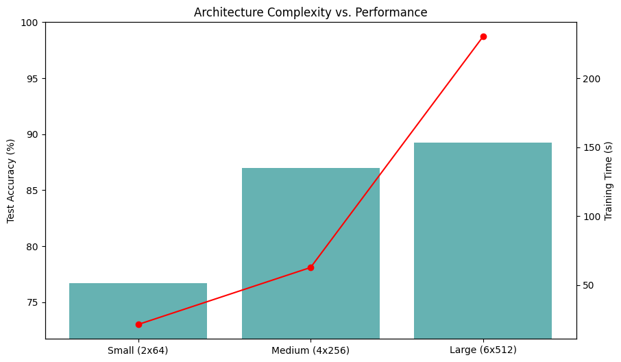
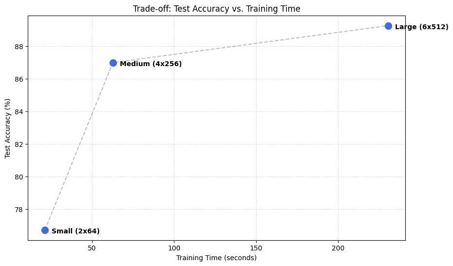
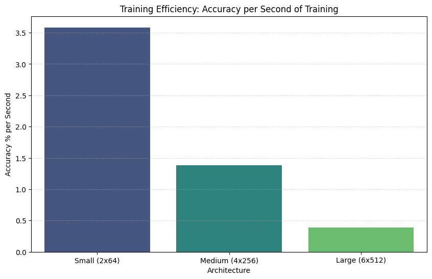
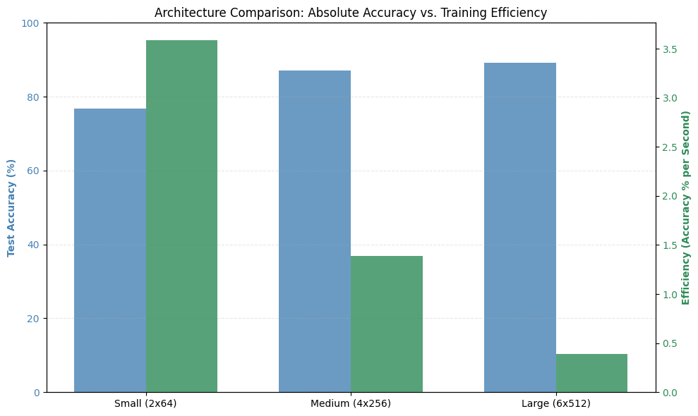
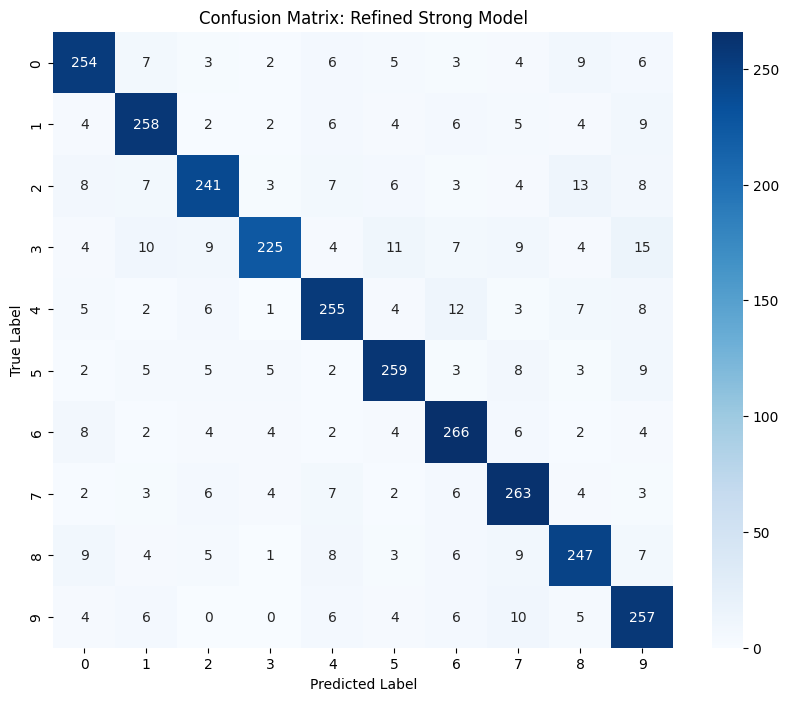
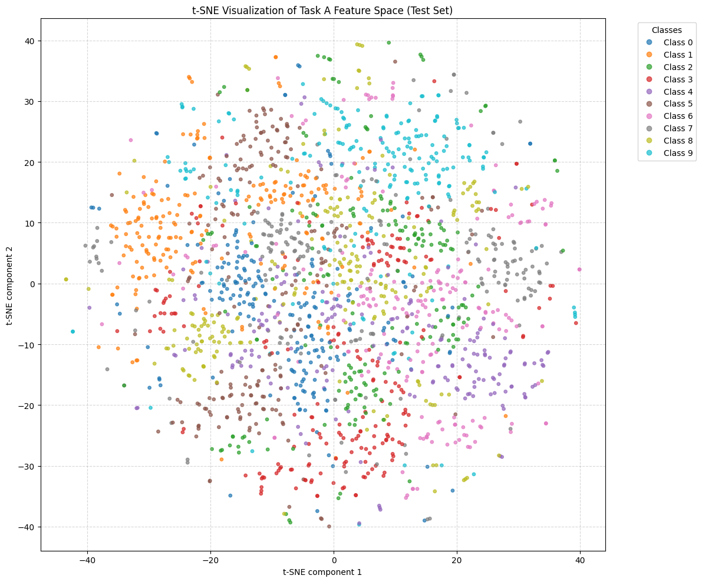

# Phase 0 Record — Learnability Gate & Task A Characterisation

**Status:** ✅ COMPLETE — gate PASSED
**Date:** 2026-06-08
**Artifacts:** `phase0_learnability_gate.py` (local gate), `phase0/Phase0_RAR_colab.ipynb`
(extended Colab analysis), `phase0/figures/` (15 figures)

---

## 1. Purpose

Before running any RAR campaign, we must prove the benchmark is **learnable and
discriminating** — i.e. a good hyperparameter configuration reaches high accuracy and a
bad one does not. Without this dynamic range, search quality cannot show up in accuracy
and the context-rot hypothesis cannot be tested. This was the root cause of the earlier
null results (all configs pinned near ~40% on a 3-class task).

**Gate criterion:** strong config test accuracy ≥ 75% **and** (strong − weak) gap ≥ 20 pp.

## 2. Task A definition (locked)

```python
make_classification(n_samples=12000, n_features=64, n_informative=55, n_redundant=0,
                    n_classes=10, n_clusters_per_class=2, class_sep=1.3, flip_y=0.02)
# non-linear warp:  X = X + 0.4*tanh(0.7X) + 0.3*sin(X*pi)
```
Training procedure: **AdamW + 2-epoch linear warmup + cosine annealing, 40 epochs,
early stopping (patience 8) on validation accuracy.** Split 50/25/25 train/val/test,
stratified; test evaluated once.

## 3. Gate result (local, `phase0_learnability_gate.py`)

Stable across three seeds:

| Seed | Strong | Weak | Gap | Gate |
|------|--------|------|-----|------|
| 42 | 82.5% | 55.8% | 26.7 pp | PASS |
| 7  | 82.7% | 55.5% | 27.2 pp | PASS |
| 13 | 82.5% | 57.6% | 24.9 pp | PASS |

## 4. Extended characterisation (Colab, `Phase0_RAR_colab.ipynb`)

We then characterised the task in depth to inform the campaign search space.

### 4.1 Architecture & learning-rate optimisation
Successive capacity increases lifted the strong-config ceiling from the gate baseline
(82.2%) to a refined peak of **91.1%**, confirming wide dynamic range above the weak
baseline (56.0%).

| Model | Config | Test acc |
|-------|--------|----------|
| Weak baseline | 1 block / 16 units / SGD lr=0.05 | 56.0% |
| Original strong (gate) | 3 blocks / 128 units / lr=1e-3 | 82.2% |
| Modified | 4 blocks / 256 units / lr=1e-3 | 87.0% |
| Super-modified | 5 blocks / 512 units / lr=1e-3 | 88.5% |
| **Refined (best)** | **5 blocks / 512 units / lr=1e-2** | **91.1%** |
| Deep (ceiling test) | 7 blocks / 768 units / lr=1e-2 | 91.3% |

**Final gate margin: 35.1 pp** (refined strong 91.1% vs weak 56.0%).



### 4.2 Learning-rate sweep
With the warmup+cosine schedule, **lr=1e-2 was optimal**; lr=1e-4 was too slow to
converge in budget, lr=5e-2 was marginally less accurate and less stable. This validates
the design decision to give the searched LR a proper schedule rather than a flat rate.





### 4.3 Efficiency analysis (accuracy vs compute)
- **Small (2×64):** most efficient (~3.6% accuracy / second).
- **Large (6×512):** highest accuracy, lowest efficiency (~230 s).
- **Medium (4×256):** best balance of performance vs compute cost.






### 4.4 Error & manifold analysis
The dominant error mode is **Class 3 ↔ Class 9 confusion**. Centroid analysis confirms
these classes are the closest pair in the 64-D space (relative proximity 1.12× the
mean inter-class distance), and t-SNE shows the non-linear warp interleaves their
boundaries — i.e. the residual errors are *systematic and geometric*, not random noise.
This is exactly the kind of hard, capacity-sensitive structure we want: it gives the
search a real optimisation target.




## 5. Conclusions & what carries into Phase 1

1. **Gate PASSED** — Task A is learnable (ceiling ~91%) and discriminating (weak ~56%),
   giving **~35 pp of dynamic range** for search quality to register in accuracy.
2. **Search-space design:** the agent's `SEARCH_SPACE` must span this range — depth up to
   ~5–7 blocks, width up to ~512, LR up to 1e-2 — so a good search can climb from the
   weak region toward the ~91% ceiling.
3. **LR schedule confirmed:** warmup + cosine with a searched peak LR (best near 1e-2) is
   the right training procedure; flat LRs underperform.
4. **Honest ceiling:** ~91% is the manifold ceiling (7×768 reached 91.3%), set by the
   Class 3/9 geometric overlap — no config will exceed it, which bounds the experiment.

## 6. Figure index

| File | Content |
|------|---------|
| cell14_fig01 | Validation loss curves across learning rates |
| cell15_fig02 | Training time vs test accuracy across LRs |
| cell17_fig03 | Validation loss over 100 epochs (lr=5e-2) |
| cell18_fig04 | Validation loss 1e-2 vs 5e-2 (100 epochs) |
| cell20_fig05 | Validation loss 1e-2 refined (40-epoch) |
| cell22_fig06 | Successive model improvements vs 75% gate |
| cell24_fig07 | Architecture complexity vs performance |
| cell26_fig08 | Accuracy vs training-time tradeoff |
| cell28_fig09 | Training efficiency (accuracy/second) |
| cell30_fig10 | Absolute accuracy vs efficiency |
| cell34_fig11 | Confusion matrix (sklearn display) |
| cell36_fig12 | Misclassified-sample feature patterns |
| cell38_fig13 | t-SNE projection (initial) |
| cell40_fig14 | t-SNE projection (enhanced, labelled) |
| cell44_fig15 | Confusion matrix heatmap (seaborn) |
